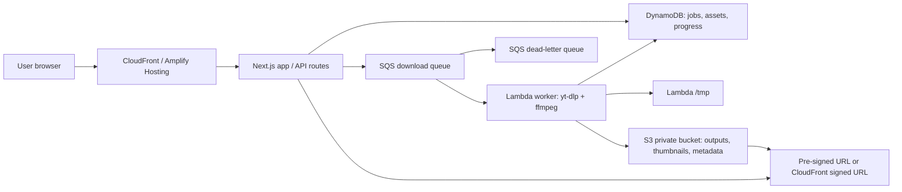
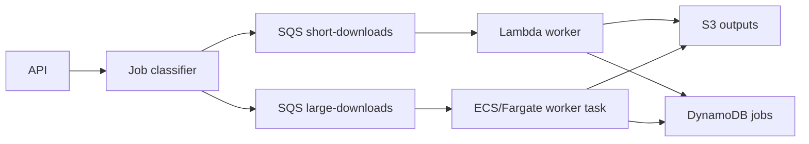

# Kymo AWS Architecture Review Plan

Last reviewed: 2026-06-29

## Executive Summary

Kymo is already built and works locally. The goal is not to change product behavior or redesign the frontend. The goal is to replace local, persistent infrastructure with AWS infrastructure that keeps MVP cost as close to zero as possible, remains simple to operate, and avoids painting the application into a corner.

The recommended MVP architecture is:

1. Keep the Next.js frontend and existing REST-style user experience.
2. Replace the persistent local download worker with an event-driven Lambda worker for short downloads.
3. Replace local filesystem storage with private S3 objects served through pre-signed URLs or CloudFront.
4. Replace the local queue with SQS plus a dead-letter queue.
5. Replace SQLite as the production source of job state with DynamoDB, using the existing SQLite flow only for local development if desired.
6. Add strict job limits, retention cleanup, reserved concurrency, and cost guardrails from day one.
7. Design the worker boundary so long-running or large downloads can later move to ECS/Fargate without changing the frontend contract.

Lambda is the best MVP choice under the stated constraints, but only if Kymo accepts clear limits:

- A Lambda invocation cannot run longer than 15 minutes.
- Lambda temporary storage is finite and should not be treated as durable storage.
- Downloading large videos, long playlists, or high-quality transcodes can exceed the free tier quickly.
- S3 storage and data transfer can become the real cost driver, not Lambda requests.
- YouTube rate limiting and datacenter IP reputation are architecture risks across Lambda, EC2, ECS, and App Runner.

The architecture should therefore be Lambda-first, not Lambda-only.

## 1. Architecture Review

### Current Architecture

Current Kymo assumptions:

- Next.js App Router
- SQLite with Drizzle
- REST APIs
- Background worker
- Queue-based downloads
- Local filesystem storage
- yt-dlp
- ffmpeg

This works well on a single machine because compute, queue state, database state, and files all live together. That same coupling is the main blocker for AWS serverless deployment.

### What Should Stay

| Area                     | Recommendation    | Why                                                                                             |
| ------------------------ | ----------------- | ----------------------------------------------------------------------------------------------- |
| Next.js frontend         | Keep              | The request is infrastructure-only. No frontend redesign is needed.                             |
| REST API semantics       | Keep              | Existing UI flows can continue to submit jobs and poll status.                                  |
| Queue-based mental model | Keep              | Queueing is the right model for downloads. Replace the implementation, not the concept.         |
| yt-dlp                   | Keep              | It is core business logic. Package it for AWS instead of replacing it.                          |
| ffmpeg                   | Keep              | It is core media processing logic. Package it carefully and constrain workloads.                |
| Asynchronous downloads   | Keep              | Downloads should not run inside request/response APIs.                                          |
| Local development flow   | Keep where useful | SQLite/local filesystem can remain useful for development if production has a separate adapter. |

### What Must Change

| Area                             | Change                                  | Why                                                                             | Migration Difficulty |
| -------------------------------- | --------------------------------------- | ------------------------------------------------------------------------------- | -------------------- |
| Persistent worker                | Replace with Lambda worker for MVP      | A 24/7 worker conflicts with zero-cost MVP goals.                               | Medium               |
| Local queue                      | Replace with SQS                        | Local queue state does not survive distributed deployment.                      | Medium               |
| SQLite production database       | Replace with DynamoDB for job state     | SQLite on Lambda or ephemeral storage is not a safe production source of truth. | Medium to high       |
| Local filesystem outputs         | Replace with S3                         | Lambda local files do not persist and should not serve user downloads.          | Medium               |
| Synchronous download assumptions | Convert to explicit async state machine | Request handlers must return quickly and let workers process jobs.              | Medium               |
| Progress tracking                | Persist coarse progress to DynamoDB     | In-memory worker progress cannot be queried across Lambda invocations.          | Medium               |
| Cleanup                          | Add S3 lifecycle and DynamoDB TTL       | Stored media can exceed free tier quickly.                                      | Low                  |
| Deployment                       | Add AWS infrastructure as code          | Manual console setup will become fragile quickly.                               | Medium               |

### Key Design Challenge

Kymo is not a typical CRUD app. It runs external binaries, downloads potentially large files, and may transcode media. That makes the worker architecture more important than the web architecture.

The main question is not "Can Lambda run yt-dlp and ffmpeg?" It can, with the right package. The main question is "Can each job finish within Lambda's hard limits while staying within free-tier cost and storage limits?" For MVP, the answer can be yes if Kymo enforces limits. For unrestricted downloading, the answer is no.

## 2. Compute Option Comparison

### Lambda

Best for:

- Short, bursty jobs.
- Low or spiky traffic.
- MVPs where idle cost must be zero.
- Queue-triggered workers.
- Simple operations without server patching.

Strengths:

- No always-on compute cost.
- Free tier includes a meaningful monthly request and compute allowance.
- SQS integration is native.
- Scales down to zero.
- Container image packaging can include yt-dlp and ffmpeg.
- Reserved concurrency and SQS maximum concurrency can limit cost and rate limiting.

Weaknesses:

- Hard 15-minute maximum runtime.
- `/tmp` storage is temporary and finite.
- Additional ephemeral storage beyond the default can add cost.
- Large ffmpeg jobs can exceed free compute quickly.
- Large container images can create ECR storage cost.
- Debugging native binary issues is less comfortable than on EC2.

Verdict:

Recommended for the MVP worker, with strict job limits and a planned escape hatch to ECS/Fargate.

### EC2

Best for:

- Lowest migration effort.
- Keeping SQLite, local filesystem, and the existing worker almost unchanged.
- Long-running downloads.
- Simple single-server prototypes.

Strengths:

- Can preserve most of the current architecture.
- Can run yt-dlp and ffmpeg naturally.
- No Lambda timeout.
- Easier shell debugging.
- EC2 free-tier eligible instances can be free for qualifying accounts and usage patterns.

Weaknesses:

- Usually requires a server running 24/7.
- Requires OS patching, process supervision, disk management, backups, and security hardening.
- Micro instances are weak for ffmpeg and can hit CPU credit limits.
- Local EBS storage becomes a scaling bottleneck.
- Scaling later requires more infrastructure redesign.
- Not as aligned with "avoid paying anything during MVP" unless the account and instance type qualify.

Verdict:

Good as a fast lift-and-shift fallback, but not the recommended long-term architecture.

### ECS/Fargate

Best for:

- Containerized workers.
- Jobs longer than Lambda's 15-minute limit.
- More predictable runtime behavior for ffmpeg.
- A future scalable worker pool.

Strengths:

- Better fit for long media processing tasks.
- Container packaging is natural.
- Can run the same worker image locally and in AWS.
- Can consume the same SQS queue and write to the same S3/DynamoDB backends.

Weaknesses:

- Not a true zero-cost MVP choice.
- More moving parts than Lambda.
- Fargate task costs begin when tasks run.
- Running an always-on ECS service conflicts with the MVP cost goal.

Verdict:

Best future fallback for jobs Lambda cannot handle. Do not start here if zero idle cost is the top priority.

### App Runner

Best for:

- Simple web container deployment.
- Teams that want minimal container operations.

Strengths:

- Easier than ECS for deploying web services.
- Good developer experience.
- Handles HTTPS and scaling.

Weaknesses:

- Charges for provisioned memory while the service is deployed.
- Not ideal for queue workers.
- Not a zero-cost MVP architecture.
- Less control over specialized worker behavior than ECS.

Verdict:

Not recommended for this MVP. It is convenient, but convenience is not the same as free-tier fit.

### Hybrid Architecture

Best for:

- Keeping MVP costs low while preserving a scale path.
- Routing small jobs to Lambda and large jobs to ECS/Fargate later.
- Avoiding a future rewrite.

Strengths:

- Lambda handles cheap short jobs.
- ECS/Fargate can later handle large, long, or playlist jobs.
- SQS, DynamoDB, and S3 remain the stable backbone.
- Frontend contract stays unchanged.

Weaknesses:

- Requires designing job profiles and routing cleanly.
- Slightly more upfront discipline.

Verdict:

This is the best long-term design. For the MVP, deploy only the Lambda path, but shape the backend so the Fargate path can be added later.

## 3. Recommended AWS Architecture

### MVP Architecture



### Core Flow

1. User submits a download request through the existing Kymo UI.
2. API validates the URL, user quota, requested format, and size/duration policy.
3. API creates a job record in DynamoDB using an idempotency key.
4. API sends an SQS message containing only the `jobId`.
5. API returns `202 Accepted` with the `jobId`.
6. UI polls an existing or lightly adjusted status endpoint.
7. SQS invokes the Lambda worker with batch size `1`.
8. Worker claims the job in DynamoDB with a conditional update.
9. Worker downloads/transcodes in `/tmp` or streams where practical.
10. Worker uploads final outputs to S3.
11. Worker marks the job complete and records S3 object keys, metadata, size, and expiration.
12. API returns a short-lived pre-signed URL or CloudFront signed URL.
13. S3 lifecycle rules delete expired outputs.
14. DynamoDB TTL eventually deletes old job records.

### Recommended MVP Services

| Purpose            | AWS Service                                                        | Notes                                                                                 |
| ------------------ | ------------------------------------------------------------------ | ------------------------------------------------------------------------------------- |
| Web hosting        | AWS Amplify Hosting or CloudFront-based Next.js deployment         | Amplify is simplest for Next.js; OpenNext/CDK is more explicit but more work.         |
| API execution      | Next.js route handlers on AWS, or API Gateway HTTP API plus Lambda | Keep request handlers short. They should enqueue jobs, not download media.            |
| Queue              | SQS Standard Queue                                                 | Use a DLQ. Use batch size 1. Do not use FIFO unless ordering is truly required.       |
| Worker             | Lambda container image or zip/layer package                        | Container image is easiest for ffmpeg; zip/layer may reduce ECR cost if small enough. |
| Job state          | DynamoDB                                                           | Use provisioned capacity for free-tier alignment.                                     |
| File storage       | S3                                                                 | Private bucket. No public objects. Lifecycle cleanup is mandatory.                    |
| Delivery           | S3 pre-signed URLs first; CloudFront later if needed               | Avoid proxying downloads through Lambda or Next.js.                                   |
| Logs and metrics   | CloudWatch                                                         | Set log retention to avoid log storage surprises.                                     |
| Secrets/config     | SSM Parameter Store or Secrets Manager                             | Prefer Parameter Store for low-cost config when secrets are simple.                   |
| Container registry | ECR private repository                                             | Keep image small and use lifecycle rules.                                             |
| Billing guardrails | AWS Budgets, billing alerts, service quotas                        | Mandatory for a public downloader.                                                    |

### Why Not Keep SQLite?

SQLite is fine for local development and single-machine deployment. It is not a good production database for this serverless AWS architecture because:

- Lambda storage is ephemeral.
- Multiple Lambda instances cannot safely share one local SQLite file.
- Putting SQLite on S3 is not a transactional database design.
- EFS adds cost and operational complexity, and it weakens the free-tier goal.

If Kymo's relational model is very complex and a database migration would delay MVP significantly, the pragmatic short-term alternative is a single EC2 instance. But if the goal is serverless AWS with low idle cost, DynamoDB is the right production job-state store.

## 4. Required Backend Changes

### 4.1 Remove the Persistent Worker

Current behavior:

- A long-running worker process watches a local queue.
- It can keep in-memory state.
- It can depend on local disk.

Target behavior:

- No persistent worker in MVP.
- Each job is processed by a Lambda invocation.
- SQS is the durable trigger.
- DynamoDB is the durable job state store.
- S3 is the durable file store.

Migration instruction:

- Extract the worker's "process one job" logic into a stateless function.
- The function input should be `jobId`, not a full job payload.
- Load all job details from DynamoDB at execution time.
- Write every important state transition to DynamoDB.
- Treat the Lambda process as disposable.

Difficulty:

- Medium if the worker already has a clean job-processing function.
- High if the worker depends heavily on process-level globals, local paths, or in-memory queue state.

### 4.2 Queue Handling

Use SQS Standard Queue for the MVP.

Recommended settings:

- Main queue: `kymo-downloads`
- Dead-letter queue: `kymo-downloads-dlq`
- Lambda batch size: `1`
- Visibility timeout: greater than the Lambda timeout plus a safety buffer
- Redrive max receive count: start with `2`
- Message payload: `{ "jobId": "..." }`

Why batch size 1:

- A single failed download should not hold multiple jobs hostage.
- Progress and idempotency are easier.
- yt-dlp/ffmpeg jobs are large enough that batching gives little benefit.

What should not go in SQS:

- Full playlist metadata
- File lists
- Large JSON payloads
- User secrets
- URLs with long-lived credentials

Put large or sensitive details in DynamoDB or S3, then pass only the `jobId`.

### 4.3 Asynchronous Processing

The API should not wait for downloads.

Recommended API behavior:

| Endpoint Behavior | Recommendation                                                     |
| ----------------- | ------------------------------------------------------------------ |
| Create download   | Validate, create job, enqueue, return `202` with `jobId`.          |
| Get job status    | Read DynamoDB and return status/progress.                          |
| Get result        | Return pre-signed URL only when job is complete.                   |
| Cancel job        | Mark cancelled in DynamoDB; worker checks state between stages.    |
| Retry job         | Create a new attempt or reset failed state with idempotency guard. |

Job state model:

- `queued`
- `claimed`
- `probing`
- `downloading`
- `transcoding`
- `uploading`
- `complete`
- `failed`
- `timed_out`
- `expired`
- `cancelled`

State transitions should use conditional writes so two workers cannot process the same job accidentally.

### 4.4 Progress Tracking

Lambda cannot rely on local memory for progress. Store progress externally.

Recommended approach:

- yt-dlp progress hook updates DynamoDB.
- ffmpeg progress updates DynamoDB at coarse intervals.
- Throttle progress writes to avoid excessive write usage.
- The UI polls status every few seconds.
- Store status text as machine-friendly stages, not free-form logs.

Suggested progress fields:

- `status`
- `stage`
- `percent`
- `downloadedBytes`
- `totalBytes`
- `speedBytesPerSecond`
- `etaSeconds`
- `attempt`
- `updatedAt`
- `errorCode`
- `errorMessage`

Write progress no more often than every 2 to 5 seconds per job unless the user experience absolutely requires more.

Do not use WebSockets for MVP unless the existing app already has them. Polling is cheaper, simpler, and easier to keep inside the free tier.

### 4.5 Temporary Files

Lambda provides temporary `/tmp` storage per execution environment. It is not durable.

Rules:

- Use `/tmp/kymo/<jobId>` for all temporary files.
- Delete temporary files before returning where practical.
- Never store user-visible completed files only in `/tmp`.
- Upload final artifacts to S3 before marking a job complete.
- Configure extra ephemeral storage only when needed.
- Prefer direct streaming to S3 when it does not complicate ffmpeg workflows.

Important constraint:

- If a job requires more temporary space than Lambda can safely provide, reject it for MVP or route it to the future ECS/Fargate worker.

### 4.6 Serving Completed Downloads

Do not serve completed videos through Lambda or Next.js. That turns web compute into a file proxy and can create timeouts and cost.

Recommended:

- Store outputs in S3 under stable object keys.
- Keep the S3 bucket private.
- Generate short-lived pre-signed URLs from the API.
- Use `Content-Disposition` for friendly filenames.
- Add CloudFront only when download performance, caching, custom domains, or signed URLs require it.

Suggested S3 key layout:

```text
outputs/{userId}/{jobId}/video.{ext}
outputs/{userId}/{jobId}/audio.{ext}
outputs/{userId}/{jobId}/thumbnail.{ext}
outputs/{userId}/{jobId}/metadata.json
tmp/{jobId}/...
```

For anonymous MVP usage, replace `userId` with a stable anonymous session or tenant key.

### 4.7 Cleanup Strategy

Cleanup is not optional. It is part of staying free-tier friendly.

S3 lifecycle rules:

- Delete `tmp/` objects after 1 day.
- Delete failed partial outputs after 1 to 3 days.
- Delete completed outputs after a short MVP retention period, such as 1 to 24 hours.
- Keep metadata longer only if needed.
- Abort incomplete multipart uploads after 1 day.

DynamoDB TTL:

- Expire idempotency records after 1 to 7 days.
- Expire completed job records after 7 to 30 days.
- Expire failed jobs after 7 to 14 days unless debugging requires more.

CloudWatch:

- Set log retention to 7 or 14 days for MVP.
- Avoid indefinite retention.

### 4.8 Retry Logic

Use two layers of retry:

1. In-process retry for transient network or YouTube errors.
2. SQS redrive retry for invocation-level failures.

Recommended policy:

- Retry transient download failures inside the worker with exponential backoff and jitter.
- Do not blindly retry known permanent failures.
- Mark jobs with structured error codes.
- Send poison messages to the DLQ after a small number of receives.
- Build a simple admin recovery path for DLQ messages later.

Permanent or semi-permanent failures:

- Unsupported URL
- Video unavailable
- Video too large for MVP policy
- Playlist too large
- Lambda timeout risk detected by preflight
- Storage quota exceeded
- Repeated YouTube rate limiting

### 4.9 Concurrency Limits

Concurrency control is required for cost, abuse prevention, and YouTube rate limiting.

Recommended MVP settings:

- Lambda reserved concurrency: start with `1` to `3`.
- SQS event source maximum concurrency: match the worker concurrency target.
- API Gateway or route-level throttling: limit job creation rate.
- User quota: daily and concurrent job limits in DynamoDB.
- Global queue cap: reject or delay job creation when backlog is too high.

Why so conservative:

- More concurrency does not always mean better UX for media downloading.
- YouTube may throttle or block high-volume datacenter traffic.
- A public downloader can burn free tier quickly.
- Lambda can scale faster than your cost controls if left unconstrained.

### 4.10 Avoiding YouTube Rate Limiting

This is not solved by choosing Lambda, EC2, ECS, or App Runner. All of them use AWS network ranges.

Recommended controls:

- Start with very low worker concurrency.
- Add per-user and global rate limits.
- Add random jitter before starting downloads.
- Cache metadata when possible.
- Avoid aggressive playlist expansion.
- Respect content availability, age restrictions, and terms that apply to the product.
- Do not design around proxy rotation as an MVP strategy.
- Detect rate-limit responses and back off instead of retrying aggressively.

### 4.11 Large Playlists

Do not process a playlist as one giant Lambda job.

Recommended playlist model:

1. Create a parent playlist job.
2. Probe playlist metadata.
3. Enforce a maximum item count for MVP.
4. Create child jobs per video.
5. Enqueue each child job separately.
6. Aggregate child status into the parent job.
7. Provide individual downloads first.
8. Add ZIP packaging only later, likely through ECS/Fargate.

MVP limits should be explicit:

- Maximum videos per playlist.
- Maximum total estimated output size.
- Maximum video duration.
- Maximum output quality.
- Maximum concurrent child jobs per user.

### 4.12 Timeout Strategy

Lambda must fail predictably before the hard timeout.

Recommended:

- Set worker timeout below the hard maximum, such as 14 minutes, to leave cleanup time.
- Preflight with yt-dlp metadata before full download.
- Reject or defer jobs likely to exceed the time or size policy.
- Check remaining execution time between stages.
- Upload logs and partial diagnostic metadata before exiting.
- Mark timeout-risk jobs as `timed_out` or `requires_large_worker`.
- Do not let SQS repeatedly retry jobs that cannot fit Lambda.

Migration path:

- When ECS/Fargate exists, route timeout-risk jobs to a separate `large-downloads` queue.

### 4.13 Idempotency

Idempotency is required because SQS can deliver messages more than once and users can retry requests.

Recommended:

- Generate an idempotency key from user/session, source URL, requested format, quality, and playlist item where appropriate.
- Use DynamoDB conditional writes to create only one active job for the same idempotency key.
- Store attempts separately from the logical job.
- Use stable S3 keys based on job ID and artifact type.
- On retry, clean partial objects before writing final outputs.
- Mark final completion only after all required S3 objects exist.

### 4.14 Failure Recovery

Failure handling should be visible to users and diagnosable by operators.

Recommended:

- Every failed job gets an error code and user-safe message.
- Internal logs include job ID, attempt, stage, and command metadata.
- DLQ messages are alarmed.
- A manual replay procedure exists for DLQ messages.
- Partial outputs are deleted by lifecycle policy.
- Jobs stuck in `claimed`, `downloading`, or `transcoding` past a heartbeat threshold can be marked stale.

### 4.15 Monitoring and Logging

Minimum MVP observability:

- CloudWatch Logs for API and worker.
- Structured JSON logs with `jobId`, `userId` or session ID, `attempt`, and `stage`.
- CloudWatch metric filters or embedded metrics for:
  - jobs started
  - jobs completed
  - jobs failed
  - timeout-risk jobs
  - bytes uploaded
  - DLQ depth
  - worker duration
  - worker throttles
- Alarms for:
  - DLQ message count greater than 0
  - high Lambda error rate
  - high Lambda throttles
  - S3 bucket size above threshold
  - estimated charges above threshold

Set log retention explicitly. Never leave MVP logs on infinite retention.

### 4.16 Security

Minimum security requirements:

- Keep S3 buckets private.
- Enable S3 Block Public Access.
- Use pre-signed URLs or CloudFront signed URLs.
- Validate URLs server-side and restrict supported domains.
- Do not allow arbitrary URL download unless the product intentionally supports it.
- Do not expose raw yt-dlp or ffmpeg command input.
- Use IAM least privilege for each Lambda.
- Store secrets in SSM Parameter Store or Secrets Manager.
- Avoid putting Lambda in a VPC unless there is a clear need; NAT Gateway can destroy the free-tier goal.
- Use API throttling and user quotas.
- Enable AWS Budgets and billing alerts before public launch.
- Use separate AWS accounts or at least separate stages for dev and prod if possible.

Abuse note:

A public YouTube downloader is an abuse and cost target. Authentication, quotas, and concurrency limits are not optional if the app is exposed publicly.

## 5. AWS Services To Use

### Required for MVP

| Service           | Use                                                          | Free-Tier Fit                                                   |
| ----------------- | ------------------------------------------------------------ | --------------------------------------------------------------- |
| AWS Lambda        | Download worker and optionally API handlers                  | Strong fit for short jobs; watch GB-seconds.                    |
| Amazon SQS        | Durable download queue                                       | Strong fit; free monthly request allowance is generous for MVP. |
| Amazon DynamoDB   | Job state, progress, idempotency, quotas                     | Strong fit if provisioned capacity is kept small.               |
| Amazon S3         | Output, thumbnail, metadata, temporary object storage        | Necessary, but storage can exceed free tier quickly.            |
| Amazon CloudWatch | Logs, metrics, alarms                                        | Necessary; set retention and avoid chatty logs.                 |
| AWS IAM           | Least privilege service roles                                | Required.                                                       |
| Amazon ECR        | Lambda container image registry if using container packaging | Watch image size and lifecycle old tags.                        |
| AWS Budgets       | Cost alerts and guardrails                                   | Required for public MVP.                                        |

### Recommended Depending on Deployment Choice

| Service                     | Use                                   | Notes                                                                            |
| --------------------------- | ------------------------------------- | -------------------------------------------------------------------------------- |
| AWS Amplify Hosting         | Host Next.js app                      | Simplest path for Next.js on AWS. Verify exact App Router features used by Kymo. |
| Amazon API Gateway HTTP API | Public backend API in front of Lambda | Useful if separating backend APIs from Next.js route handlers.                   |
| Amazon CloudFront           | CDN for app and downloads             | Useful for download egress and custom domain.                                    |
| AWS Certificate Manager     | TLS certificates                      | Free public certificates for AWS-integrated services.                            |
| Amazon Route 53             | DNS                                   | Not free; use only if custom DNS is required.                                    |
| SSM Parameter Store         | Configuration and simple secrets      | Lower-cost than Secrets Manager for simple config.                               |
| AWS CloudFormation/CDK/SAM  | Infrastructure as code                | Use one IaC path. Do not manage core resources manually.                         |

### Not Recommended for MVP

| Service                       | Reason                                                                                                                                           |
| ----------------------------- | ------------------------------------------------------------------------------------------------------------------------------------------------ |
| NAT Gateway                   | Expensive for MVP and usually unnecessary for this design.                                                                                       |
| RDS/Aurora                    | Easier relational migration, but not the best free-tier-long-term fit.                                                                           |
| EFS                           | Adds cost and complexity; avoid using it to preserve SQLite.                                                                                     |
| App Runner                    | Operationally simple but not zero idle cost.                                                                                                     |
| Always-on ECS/Fargate service | Better for scale, not for zero-cost MVP.                                                                                                         |
| WAF                           | Use only if risk requires it. If CloudFront's current free plan fits Kymo, evaluate its included protections before adding standalone WAF spend. |

## 6. Deployment Steps

### Phase 0: Account and Cost Guardrails

1. Choose the AWS account plan deliberately.
   - New AWS Free Tier accounts can receive credits and a free plan with no surprise charges, but service access and duration differ from a normal paid account.
   - A paid plan gives broader access but can charge beyond credits and free allowances.
2. Enable MFA on the root account.
3. Create an IAM admin role/user for deployment.
4. Create AWS Budgets alerts at very low thresholds.
5. Enable billing alerts.
6. Pick one region and keep all MVP resources in that region.
7. Avoid multi-region deployment for MVP.

### Phase 1: Storage and State

1. Create the S3 bucket for outputs and metadata.
2. Block all public access.
3. Add lifecycle rules for `tmp/`, failed outputs, completed outputs, and multipart uploads.
4. Create DynamoDB tables for:
   - jobs
   - idempotency records
   - optional user/session quotas
5. Use provisioned capacity at small values for free-tier alignment.
6. Add TTL attributes.
7. Add indexes only when required by access patterns.

### Phase 2: Queue

1. Create SQS Standard Queue.
2. Create SQS DLQ.
3. Configure redrive policy.
4. Set visibility timeout based on worker timeout.
5. Keep message body small.

### Phase 3: Worker

1. Package yt-dlp and ffmpeg for Lambda.
2. Prefer a slim container image if zip/layer packaging is too tight.
3. Keep the ECR repository small with lifecycle rules.
4. Configure Lambda memory based on real download/transcode tests.
5. Start with default ephemeral storage; increase only when measurements require it.
6. Set timeout below 15 minutes.
7. Configure reserved concurrency.
8. Connect SQS event source with batch size 1.
9. Add structured logging.
10. Add environment variables for bucket, table, queue, retention, and limits.

### Phase 4: API Changes

1. Change download creation to create a DynamoDB job and enqueue SQS.
2. Change status endpoints to read DynamoDB.
3. Change result endpoints to generate pre-signed URLs.
4. Remove any API behavior that reads final media from local disk.
5. Add idempotency handling.
6. Add job validation and MVP limits.
7. Add per-user/session quotas.

### Phase 5: Next.js Hosting

Recommended simple path:

1. Deploy the Next.js app with AWS Amplify Hosting if Kymo's App Router features are supported.
2. Configure environment variables for AWS resources.
3. Ensure server-side route handlers have IAM permissions only for required resources.
4. Use CloudFront/Amplify managed TLS for the app.

Alternative explicit path:

1. Use an OpenNext/CDK-style deployment to CloudFront, Lambda, and S3.
2. Manage all resources with CloudFormation/CDK.
3. Use this if the team wants more control than Amplify provides.

### Phase 6: CI/CD

For strict zero-cost MVP:

1. Use local builds and manual IaC deploys initially.
2. Keep deployment commands documented.
3. Avoid always-on CI runners or excessive managed build minutes.

For managed AWS-only CI/CD:

1. Use Amplify's Git-based deployment for the Next.js app if build minutes fit the budget.
2. Use CodePipeline/CodeBuild later for worker image builds and infrastructure deployment.
3. Add ECR image lifecycle cleanup.
4. Deploy dev before prod.
5. Require rollback steps for failed worker deployments.

### Phase 7: Verification

Before public MVP:

1. Submit a small audio-only job.
2. Submit a small video job.
3. Submit an unsupported URL.
4. Submit a video above MVP limits.
5. Submit duplicate requests and verify idempotency.
6. Force a worker failure and verify DLQ behavior.
7. Verify completed files are private in S3.
8. Verify pre-signed URLs expire.
9. Verify S3 lifecycle deletes old objects.
10. Verify DynamoDB TTL attributes are written.
11. Verify CloudWatch logs include job IDs.
12. Verify concurrency cannot exceed the configured cap.
13. Verify estimated AWS charges after a test batch.

## 7. Cost Analysis

### Important Cost Reality

"Free tier" does not mean "impossible to be charged" unless the account is on an AWS Free plan that blocks charges by design. On a normal paid AWS account, exceeding any free allowance can create charges.

The cost-sensitive parts of Kymo are:

1. Lambda GB-seconds for long ffmpeg work.
2. S3 storage for completed videos.
3. Data transfer out when users download results.
4. CloudWatch logs if the worker is chatty.
5. ECR storage if container images are large.
6. API/hosting build minutes and requests.

### Current AWS Free-Tier Signals To Design Around

These are the official AWS references checked for this plan:

- AWS Free Tier program: https://aws.amazon.com/free/
- Lambda pricing and free allowance: https://aws.amazon.com/lambda/pricing/
- Lambda quotas: https://docs.aws.amazon.com/lambda/latest/dg/gettingstarted-limits.html
- Lambda ephemeral storage: https://docs.aws.amazon.com/lambda/latest/dg/configuration-ephemeral-storage.html
- SQS pricing: https://aws.amazon.com/sqs/pricing/
- DynamoDB pricing: https://aws.amazon.com/dynamodb/pricing/
- S3 pricing: https://aws.amazon.com/s3/pricing/
- CloudFront pricing: https://aws.amazon.com/cloudfront/pricing/
- API Gateway pricing: https://aws.amazon.com/api-gateway/pricing/
- ECR pricing: https://aws.amazon.com/ecr/pricing/
- EC2 Free Tier details: https://docs.aws.amazon.com/AWSEC2/latest/UserGuide/ec2-free-tier-usage.html
- Fargate pricing: https://aws.amazon.com/fargate/pricing/
- App Runner pricing: https://aws.amazon.com/apprunner/pricing/
- CloudWatch pricing: https://aws.amazon.com/cloudwatch/pricing/

CloudFront currently deserves special attention because AWS offers a
CloudFront free plan with included monthly traffic/request allowances and some
security features. Validate the current terms before launch, but it may make
CloudFront a better MVP delivery surface than raw S3 URLs once public download
traffic begins.

### Lambda Cost Intuition

Lambda's free compute allowance is generous for short API requests, but media processing consumes it quickly.

Approximate free-tier job capacity before Lambda compute charges, ignoring API calls:

| Worker Size and Duration | GB-seconds per Job | Approx Jobs Covered by 400,000 GB-seconds |
| ------------------------ | -----------------: | ----------------------------------------: |
| 2 GB for 3 minutes       |                360 |                                     1,111 |
| 3 GB for 5 minutes       |                900 |                                       444 |
| 5 GB for 10 minutes      |              3,000 |                                       133 |
| 10 GB for 15 minutes     |              9,000 |                                        44 |

Interpretation:

- Lambda is excellent for low-volume MVP usage.
- Lambda is not free at scale for heavy ffmpeg jobs.
- Memory tuning matters because CPU and cost scale with configured memory.
- Audio-only jobs are much more free-tier friendly than large video transcodes.

### S3 Cost Risk

S3 can exceed free allowances quickly if completed videos are retained.

Examples:

- Ten 500 MB completed files equals roughly 5 GB.
- A few high-quality playlist downloads can exceed that.
- Lifecycle deletion is the main cost control.

Recommendation:

- For MVP, expire completed downloads aggressively.
- Treat Kymo as a temporary delivery service, not a permanent media library.

### Data Transfer Risk

Serving downloads creates egress.

Recommendation:

- Use S3 pre-signed URLs for simplicity.
- Consider CloudFront if it improves free egress coverage, download performance, or custom-domain delivery.
- Do not proxy media through Lambda or the Next.js server.

### DynamoDB Cost Strategy

For MVP:

- Use provisioned capacity with low RCU/WCU values to align with free-tier allowances.
- Keep item sizes small.
- Avoid unnecessary global secondary indexes.
- Throttle progress updates.

Switch to on-demand later if traffic becomes unpredictable and paying a small amount for operational simplicity is acceptable.

### ECR Cost Strategy

ffmpeg container images can be large.

Recommendation:

- Keep only one or two image tags.
- Use lifecycle rules.
- Use a slim base image.
- Consider Lambda layers or zip packaging if the package fits.
- Watch ECR storage because private repository free allowance is limited.

### MVP Cost Recommendation

To stay near zero:

1. Keep worker concurrency low.
2. Cap max duration, output size, playlist size, and quality.
3. Expire outputs quickly.
4. Avoid NAT Gateway.
5. Avoid RDS, EFS, App Runner, and always-on ECS services.
6. Use CloudWatch log retention.
7. Deploy manually or with low-build-minute CI until traffic justifies automation.
8. Put AWS Budgets alerts in place before sharing the app publicly.

## 8. Risks

### Risk 1: Lambda Timeout

Impact:

- Long downloads or transcodes fail.

Mitigation:

- Preflight metadata.
- Enforce MVP limits.
- Leave cleanup time before timeout.
- Add ECS/Fargate fallback later.

### Risk 2: Temporary Storage Exhaustion

Impact:

- Large files fail mid-job.

Mitigation:

- Estimate output size.
- Cap quality and duration.
- Use streaming where practical.
- Configure only as much ephemeral storage as needed.
- Route large jobs away from Lambda later.

### Risk 3: S3 Storage Cost

Impact:

- Completed files accumulate and create charges.

Mitigation:

- Short retention.
- S3 lifecycle rules.
- User-visible expiration times.
- Bucket size alarms.

### Risk 4: Data Transfer Cost

Impact:

- Popular downloads can create egress charges.

Mitigation:

- Short-lived URLs.
- CloudFront when appropriate.
- Quotas.
- Budgets.
- Avoid serving files through compute.

### Risk 5: YouTube Rate Limiting

Impact:

- Failed jobs and poor UX.

Mitigation:

- Low concurrency.
- Backoff and jitter.
- Per-user limits.
- Metadata caching.
- Avoid aggressive retries.

### Risk 6: Public Abuse

Impact:

- Cost spike, service degradation, account risk.

Mitigation:

- Authentication if public.
- API throttling.
- User quotas.
- Reserved concurrency.
- Strict supported-domain validation.
- Billing alarms.

### Risk 7: Database Migration Complexity

Impact:

- Moving from SQLite/Drizzle to DynamoDB may touch many backend paths.

Mitigation:

- Create a repository/data-access boundary first.
- Migrate only job-state and asset metadata needed for production.
- Keep SQLite for local development if useful.
- Avoid relational features in the job execution path.

### Risk 8: Packaging Native Binaries

Impact:

- Lambda deployment or runtime issues.

Mitigation:

- Use a reproducible container build.
- Test yt-dlp and ffmpeg inside the Lambda-like environment.
- Keep image small.
- Pin versions.
- Add a simple health/self-test command in deployment verification.

### Risk 9: Legal and Terms-of-Service Exposure

Impact:

- Product, account, or user risk depending on how Kymo is used.

Mitigation:

- Ensure the product only supports permitted use cases.
- Add policy controls where needed.
- Avoid designing infrastructure whose purpose is to bypass platform restrictions.

## 9. Future Scaling Strategy

### Scale Path 1: Keep Lambda, Increase Limits Carefully

Use when:

- Jobs still finish within Lambda limits.
- Traffic grows but job profiles remain small.

Actions:

- Tune memory for best cost/performance.
- Increase reserved concurrency slowly.
- Add CloudFront for delivery.
- Add better dashboards.
- Move DynamoDB to on-demand if operations exceed provisioned capacity planning.

### Scale Path 2: Add ECS/Fargate Worker for Large Jobs

Use when:

- Jobs exceed 15 minutes.
- Files exceed Lambda temp storage.
- ffmpeg workloads need more predictable CPU.
- Playlist packaging becomes important.

Target architecture:



Key point:

The API, frontend, DynamoDB schema, SQS job ID pattern, and S3 output model should not change. Only the worker runtime changes.

### Scale Path 3: ECS on EC2 for Cost Optimization

Use when:

- Volume is high and Fargate becomes expensive.
- Jobs are long and CPU-heavy.
- The team can operate instances.

Actions:

- Run ECS on EC2 Auto Scaling groups.
- Scale worker capacity based on SQS queue depth.
- Consider Spot Instances for interruptible jobs.
- Keep the same job-state and storage contract.

### Scale Path 4: Step Functions for Complex Workflows

Use when:

- Jobs have many stages.
- Playlists need fan-out/fan-in orchestration.
- Retries need per-stage policies.
- Human-readable workflow visibility matters.

Do not start here for MVP unless orchestration complexity is already painful. Step Functions can add cost and complexity.

### Scale Path 5: RDS or Aurora Only If Relational Needs Win

Use when:

- Kymo grows into a relational product with complex querying.
- DynamoDB access patterns become awkward.
- Strong relational constraints are needed.

For download job state alone, DynamoDB is a better cost and operations fit.

## 10. Final Recommendation

Use Lambda for the MVP worker, but design Kymo as an asynchronous AWS media-processing system rather than a Lambda port of the local worker.

The best architecture for the stated constraints is:

- Next.js frontend unchanged.
- API creates jobs and returns immediately.
- SQS owns durable queueing.
- Lambda processes short jobs.
- DynamoDB owns job state, progress, idempotency, and quotas.
- S3 owns all generated files.
- Pre-signed URLs or CloudFront deliver files.
- Lifecycle rules aggressively delete outputs.
- Reserved concurrency and quotas protect cost and YouTube rate limits.
- ECS/Fargate is reserved for the first moment Lambda's limits become product limits.

Do not start with App Runner or Fargate for the MVP if avoiding cost is the top priority. Do not keep SQLite/local filesystem in production if using Lambda. Do not proxy downloads through web compute. Do not treat free tier as a substitute for quotas and cleanup.

The strategic choice is not "Lambda forever." The strategic choice is to make SQS, DynamoDB, and S3 the stable backend contract. Once that contract exists, Lambda is just the first worker runtime. If Lambda stops fitting, the worker can move to ECS/Fargate without rewriting the frontend or changing the user-facing API.
